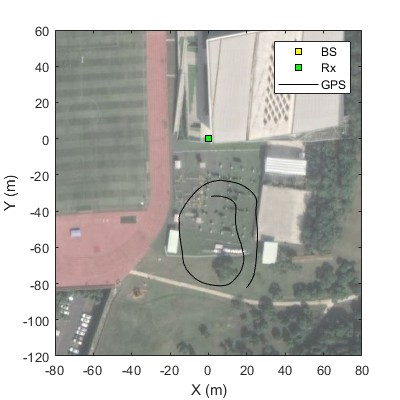
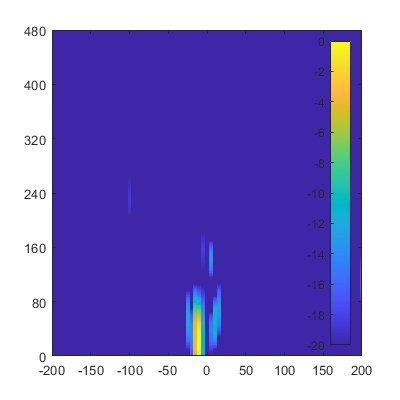

# LIPASE Dataset

## Overview
The **LIPASE** (LTE-based dIgital array PAssive SEnsing system) dataset contains experimental data for passive UAV tracking using LTE downlink signals and digital antenna arrays. This dataset was collected as part of the research presented in:

> **"An Experimental Study of Passive UAV Tracking with Digital Arrays and Cellular Downlink Signals"**  
> *Yifei Sun, Chao Yu, Yan Luo, Haisheng Tan, Rui Wang, Francis C. M. Lau*  
> **[Preprint available on arXiv](https://arxiv.org/abs/2412.20788)**

The dataset is designed to support research in **passive radar, UAV tracking, and integrated sensing and communications (ISAC)** by providing raw and processed data from real-world experiments.

---
<p align="center">
    <!---->
     <br>
</p>

## Data Description
The dataset contains the following components:

<!--- **Raw IQ Samples**: Baseband signals collected by software-defined radios (SDRs) from LTE downlink transmissions.-->
<!--- - **Preprocessed Signals**: Interference-suppressed signals.-->
- **Range-Doppler Maps**: Processing results from cross-ambiguity function calculations.
- **Matlab Scripts**: Scripts to read the range-Doppler maps and plot the GPS data on map.

---

## Experiment Setup
- **Transmitter**: Commercial LTE eNB operating at 2130–2135 MHz.
- **Receiver**: Passive sensing system with two uniform linear antenna arrays (ULAs).
- **Target**: UAV flying a circle trajectory while reflecting LTE signals.
- **Baseline Distance**: 255 meters between eNB and LIPASE receiver.
- **Sampling Rate**: 25 MHz.

---

<!--
## File Structure
```plaintext
LIPASE-Dataset/
│── raw_data/                      # Raw IQ samples
│── processed_data/                 # Preprocessed signals (beamformed, clutter-suppressed)
│── range_doppler_maps/             # Cross-ambiguity function results
│── matlab_scripts/                 # MATLAB scripts for processing data
│── README.md                       # This file
```
```plaintext
LIPASE-Dataset/
│── main.m                         # Main MATLAB script for processing data
│── data/
│   ├── gps/                        # GPS data
│   ├── raw/                        # Raw IQ samples
│   ├── preprocessed/               # Preprocessed IQ signals (clutter-suppressed)
│   ├── rdplot/                     # RD plot
│── fun/                            # MATLAB functions
│── README.md                       # This file
```

## How to Download the Dataset
Due to its large size, the dataset cannot be directly uploaded to GitHub. Please download it from the following link:

🔗[Download LIPASE Dataset](https://lasso525.quickconnect.cn/d/s/12HGCyjHEZhcjowa9ELTeg13N6VfRG51/6C9oAboGjXWV89wfowvX7YDko_x_1GYp-4rxAmCZeEww)

---

## How to Use the Dataset
1. **Download the dataset**  
   - Extract the data files after downloading.

2. **Process the raw signals**  
   - Use the MATLAB scripts 'main.m' to generate range-Doppler maps.

3. **Generate range-Doppler maps**  
   - Open MATLAB and run the provided scripts.

---
-->

## Citation
If you use this dataset in your research, please cite:
```bibtex
@misc{sun2024experimentalstudypassiveuav,
      title={An Experimental Study of Passive UAV Tracking with Digital Arrays and Cellular Downlink Signals}, 
      author={Yifei Sun and Chao Yu and Yan Luo and Tony Xiao Han and Haisheng Tan and Rui Wang and Francis C. M. Lau},
      year={2024},
      eprint={2412.20788},
      archivePrefix={arXiv},
      primaryClass={eess.SP},
      url={https://arxiv.org/abs/2412.20788}, 
}
```

---

## License
This dataset is licensed under the Creative Commons Attribution 4.0 License. You are free to use, share, and adapt the data, provided that proper attribution is given.

---

## Contact
For questions, please contact:

- Yifei Sun: yfsun0327@connect.hku.hk

For updates, visit the GitHub Repository:
https://github.com/yfsun0327/dataset-LIPASE


